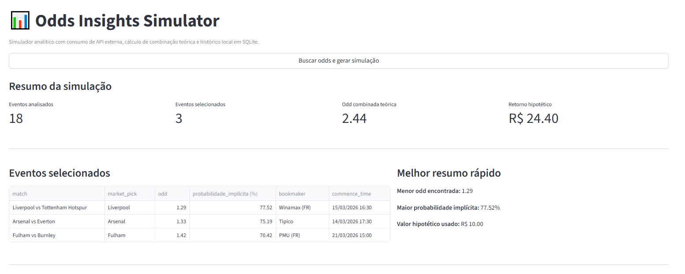
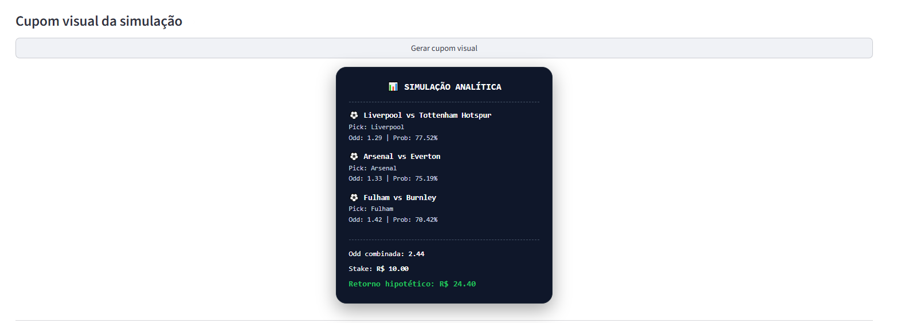
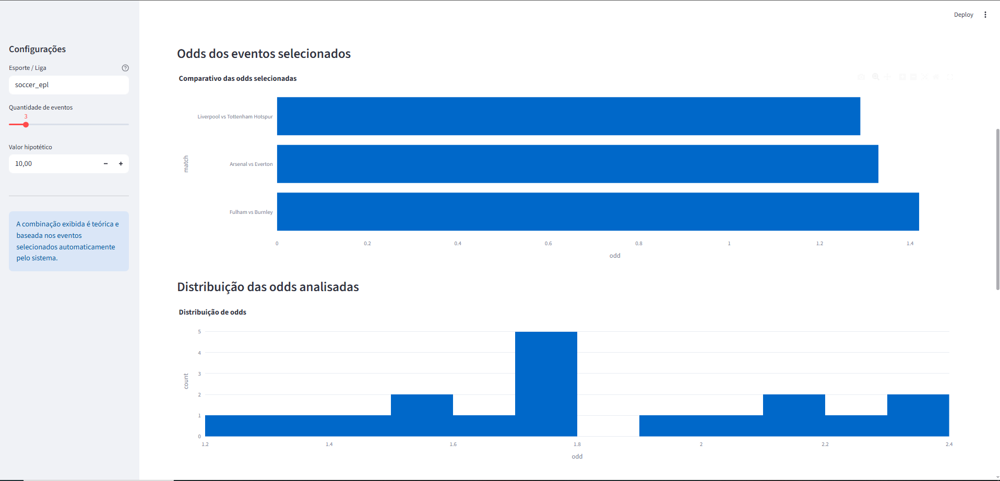

Odds Insights Simulator

Interactive sports odds analytics dashboard built with Python, Streamlit, Plotly and SQLite.

This project consumes real-time odds from an external API, processes the data to generate theoretical combinations, calculates implied probabilities, and displays everything in a modern interactive dashboard.

It also stores simulations locally and generates a visual coupon-style summary for presentation and analysis.

Preview
## Dashboard Preview

### Main Dashboard

### Simulation Coupon

### Odds Distribution

Example dashboard sections:

Simulation summary

Selected events table

Odds comparison chart

Odds distribution

Top events by implied probability

Visual simulation coupon

Simulation history

Features

External sports odds API integration

Automatic event ranking based on odds

Theoretical combined odds simulation

Implied probability calculation

Interactive Plotly charts

Streamlit dashboard UI

SQLite persistence for simulation history

Coupon-style visual summary for simulations

Tech Stack
Technology	Purpose
Python	Core backend logic
Streamlit	Interactive dashboard
Plotly	Data visualization
Pandas	Data manipulation
Requests	API integration
SQLite	Local persistence
HTML/CSS	Custom UI components
Project Structure
odds-insights-simulator
│
├── app
│   ├── services
│   │   ├── analytics.py
│   │   ├── odds_provider.py
│   │   └── simulation_service.py
│   │
│   ├── db
│   │   ├── connection.py
│   │   └── repository.py
│   │
│   └── config.py
│
├── dashboard
│   └── streamlit_app.py
│
├── tests
│   └── test_analytics.py
│
├── data
│   └── simulations.db
│
├── requirements.txt
├── .env.example
└── README.md
Installation

Clone the repository:

git clone https://github.com/Sant7z/odds-insights-simulator.git
cd odds-insights-simulator

Create a virtual environment:

python -m venv venv

Activate it:

Windows:

venv\Scripts\activate

Install dependencies:

pip install -r requirements.txt
Environment Variables

Create a .env file based on .env.example.

Example:

ODDS_API_KEY=your_api_key_here
ODDS_API_BASE_URL=https://api.the-odds-api.com/v4
Running the Dashboard

Start the Streamlit application:

streamlit run dashboard/streamlit_app.py

The dashboard will open automatically in your browser:

http://localhost:8501
Example Simulation Output

The system generates a visual coupon-style summary including:

Selected matches

Market pick

Odds

Implied probability

Combined theoretical odds

Hypothetical return

This visualization helps demonstrate the simulation results clearly in the dashboard.

Future Improvements

Potential improvements for the project:

API caching

Automatic odds refresh

Bookmaker comparison

Arbitrage opportunity detection

Export simulation as image

REST API with FastAPI

Historical odds tracking

Author

Albert Sant'Ana

Computer Engineering student focused on Python, data automation and backend development.

GitHub:
https://github.com/Sant7z

License

This project is for educational and analytical purposes only.